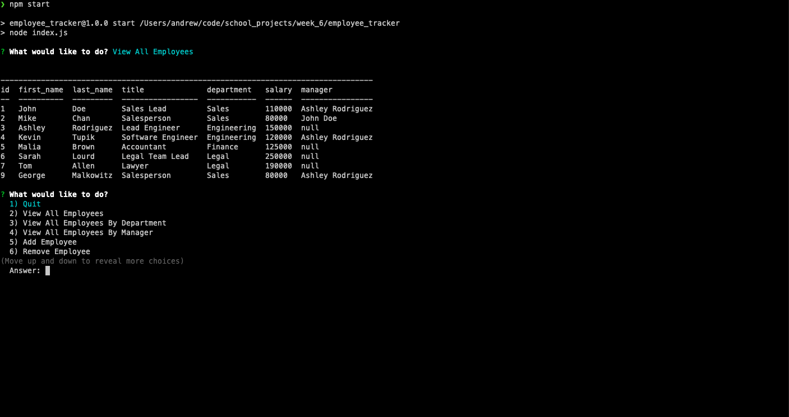
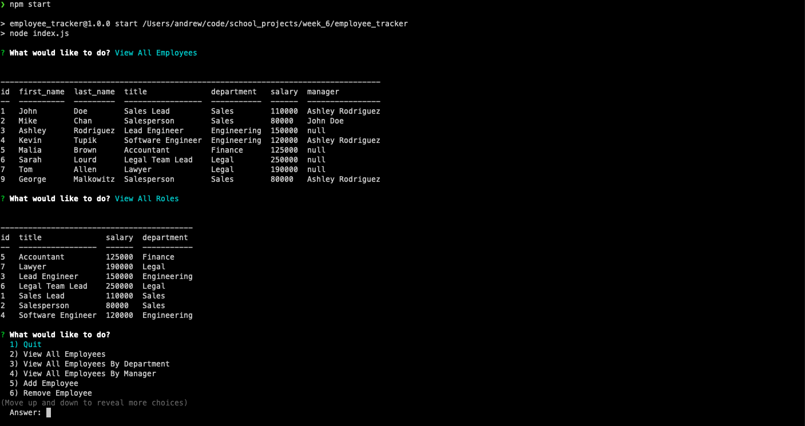

# Employee Tracker
 
  
---

## Description
Content Management System (CMS) solution for managing a company's employees using node, inquirer and MySql. It has an easy interface that non-developers can interact with information stored in a database.

---
## Table of Contents
  
1. [ Description ](#description)
2. [ Visuals ](#visuals)
3. [ Demo](#demo)
4. [ Installation](#installation)
5. [ Usage ](#usage)
6. [ License ](#license)
7. [ Contributing ](#contributing)
8. [ Questions ](#questions)

---

## Visuals

---

## Demo

Checkout the [demo page](https://drive.google.com/file/d/1A7r9qNs04ci4I-rrXqMaS7Dn5ziWPy0l/view) to see Employee Tracker in action.

---

## Installation

  
*Dependencies: Running MySql Server*

How to Install:

1. Run the following command at the root of your project.

    ``
    npm install
    ``

2. Run the Command

    ``
    mysql -u root -p
    ``  

3. Enter your password

4. Run the Command
    
    ``
    source ./data/schema.sql
    `` 

5. (Optional) Run this command if you want to seed the database with dummy data

    ``
    source ./data/seeds.sql
    `` 

6. Run the Command

    ``
    \q
    `` 

7. Run this command to start the program

    ``
    npm start
    `` 

---

## Usage

1. Run the following command at the root of your project.

    ``
    npm start
    ``

2. Start by first adding your departments by selecting:

    ``
    16) Add Department
    ``
    *You will need to add each department one at a time*

3.  Next add your roles by selecting:

    ``
    11) Add Role
    ``
    *You will need to add each role one at a time*

3.  Next add your employees by selecting:

    ``
    5) Add Employee
    ``
    *You will need to add each employee one at a time*

    *Note: It is best to add the employee highest in the tree first and work your way down because you can not select a manager for an employee unless they are already an employee in the database.*

4.  Next you can start using the CLI to gather the data you need or make adjustments to the employee database. Be warned that all instructions are permanent.

---

## License

Copyright (c) 2020, Andrew Crow. (MIT License)

---

## Contributing

We are currently not allowing outside contributors to this project, but check back because things can change.

---

## Questions

If you have questions you can reach me here:
  
Email: andrew@crow.me

GitHub: [Github Profile](https://github.com/crowandrew)

  ---

